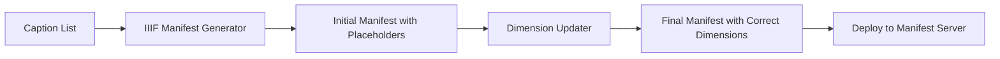

# IIIF Manifest Dimension Updater

A browser-based tool for automatically updating IIIF manifest dimensions by fetching actual image sizes from IIIF Image API endpoints.

## Overview

This tool solves a common workflow problem in IIIF manifest generation: when creating manifests from caption lists or templates, the image dimensions are often unknown or set to placeholder values. The Dimension Updater automatically queries each image's IIIF server to retrieve actual dimensions and updates the manifest accordingly.

## Features

- 🎯 **Automatic dimension fetching** from IIIF Image API `info.json` endpoints
- 📦 **Batch processing** - update multiple manifests at once
- 🖱️ **Drag-and-drop interface** for easy file handling
- 📊 **Real-time progress tracking** with detailed logging
- ✅ **Updates both Canvas and Image body dimensions**
- 🔄 **Preserves all other manifest properties** unchanged
- ⚡ **No server required** - runs entirely in the browser
- 🎨 **Clean, responsive interface** with visual feedback

## Use Cases

### Primary Use Case
When generating IIIF manifests from structured data (caption lists, CSV files, or templates), the actual image dimensions are often unknown. This tool updates those manifests with correct dimensions fetched directly from your IIIF image server.

### Workflow Integration
1. Generate initial manifests using your preferred method (manual creation, script generation, or the IIIF Manifest Generator)
2. Use this tool to update all dimensions automatically
3. Deploy the corrected manifests to your manifest server

### Specific Scenarios
- **Academic publishing**: Ensuring precise dimensions for article figures
- **Digital collections**: Batch-correcting manifests after migration
- **Multi-image comparisons**: Getting exact dimensions for layout calculations
- **Quality control**: Verifying and correcting dimension data

## Requirements

- Modern web browser (Chrome, Firefox, Safari, Edge)
- CORS-enabled IIIF image server (or use with browser CORS extensions for testing)
- IIIF Presentation API 3.0 manifests with ImageService3 declarations

## Installation

1. Download `IIIF_manifest_dimension_updater.html` from the `../src/size_updater/` folder
2. Open the file in your web browser
3. No installation or dependencies required!

## Usage

### Basic Operation

1. **Open the tool** in your browser
2. **Load manifest files** using either:
   - Drag and drop JSON files onto the upload area
   - Click "Select Files" to browse and select files
3. **Wait for processing** - the tool will:
   - Parse each manifest
   - Extract IIIF service URLs
   - Query each image's `info.json` endpoint
   - Update Canvas and Image dimensions
   - Generate downloadable corrected manifests
4. **Download updated files** - click the download links that appear

### Understanding the Process

For each manifest file, the tool:

1. **Extracts IIIF service endpoints** by searching for `ImageService3` declarations
2. **Queries each unique service** at `{serviceId}/info.json`
3. **Updates dimensions** in two places:
   - **Canvas dimensions**: The viewport size for the image
   - **Image body dimensions**: The actual image dimensions
4. **Preserves all other data** including labels, metadata, and annotations

### Reading the Log Output

The tool provides detailed logging with color-coded messages:

- 🔵 **Blue (Info)**: General processing information
- 🟢 **Green (Success)**: Successful operations
- 🔴 **Red (Error)**: Failed operations or issues

Example log output:
```
[10:23:45] Processing: manuscript_001.json
[10:23:45] Found 3 IIIF services
[10:23:45] Querying: https://iiif.example.org/image/page1
[10:23:46] ✓ https://iiif.example.org/image/page1: 3000x4000
[10:23:46] Updated Canvas: 3000x4000
[10:23:46] Updated Image: 3000x4000
[10:23:47] ✓ manuscript_001.json processed successfully
```

## Technical Details

### How It Works

The tool uses the IIIF Image API's `info.json` endpoint to retrieve actual image dimensions. This endpoint provides authoritative dimension data directly from the image server.

#### IIIF Service Detection
```javascript
// The tool searches for services like:
{
  "service": [{
    "id": "https://iiif.example.org/image/identifier",
    "type": "ImageService3",
    "profile": "level2"
  }]
}
```

#### Dimension Updates
The tool updates dimensions in two contexts:

1. **Canvas objects**:
```json
{
  "type": "Canvas",
  "width": 3000,  // Updated from info.json
  "height": 4000   // Updated from info.json
}
```

2. **Image body objects**:
```json
{
  "type": "Image",
  "width": 3000,  // Updated from info.json
  "height": 4000   // Updated from info.json
}
```

### Rate Limiting

The tool includes a 100ms delay between IIIF server requests to avoid overwhelming servers. This is particularly important when processing manifests with many images.

### Error Handling

- **Network failures**: Logged but don't stop processing
- **Invalid JSON**: Reported with specific error messages
- **Missing services**: Skipped with warnings
- **CORS issues**: Reported with suggestions for resolution

## Troubleshooting

### CORS Errors

If you encounter CORS errors:

1. **Check server configuration**: Ensure your IIIF server allows CORS requests
2. **Use a browser extension**: For testing, use a CORS-enabling extension
3. **Run locally**: Host the tool on the same domain as your IIIF server
4. **Contact server admin**: Request CORS headers be added for your domain

### No Dimensions Updated

If dimensions aren't being updated:

1. **Check service type**: Tool currently supports `ImageService3` only
2. **Verify service URLs**: Ensure service IDs are complete URLs
3. **Test info.json access**: Try accessing `{serviceId}/info.json` directly
4. **Review log output**: Check for specific error messages

### Performance Issues

For large batches:

1. **Process in smaller groups**: Split files into batches of 10-20
2. **Check browser console**: Look for memory or timeout issues
3. **Close other tabs**: Free up browser resources
4. **Use a modern browser**: Ensure you're using an updated browser version

## Integration with IIIF Manifest Generator

This tool complements the IIIF Manifest Generator by:

1. **Fixing placeholder dimensions** in generated manifests
2. **Validating image availability** before deployment
3. **Preparing manifests for production** use

### Recommended Workflow



## Browser Compatibility

| Browser | Minimum Version | Notes |
|---------|----------------|--------|
| Chrome | 90+ | Full support |
| Firefox | 88+ | Full support |
| Safari | 14+ | Full support |
| Edge | 90+ | Full support |

## Limitations

- Supports IIIF Presentation API 3.0 manifests only
- Currently handles `ImageService3` type (ImageService2 support can be added)
- Requires CORS-enabled IIIF servers for cross-origin requests
- Browser memory limits may affect very large manifests (>1000 images)

## Contributing

To enhance this tool, consider:

- Adding `ImageService2` support
- Implementing custom delay configuration
- Adding CSV export of dimension data
- Creating a command-line version for server-side processing
- Adding validation for IIIF Presentation API compliance

## License

This tool is provided as-is for use in IIIF workflows. Feel free to modify and adapt it to your specific needs.

## Support

For issues or questions related to:
- **This tool**: Open an issue in the repository
- **IIIF specifications**: Consult [iiif.io](https://iiif.io)
- **IIIF server configuration**: Contact your IIIF server administrator

## Acknowledgments

Developed for the digital humanities community to streamline IIIF manifest workflows, particularly for academic publishing and digital collection management at institutions like Bibliotheca Hertziana.

---

*Last updated: September 2025*
